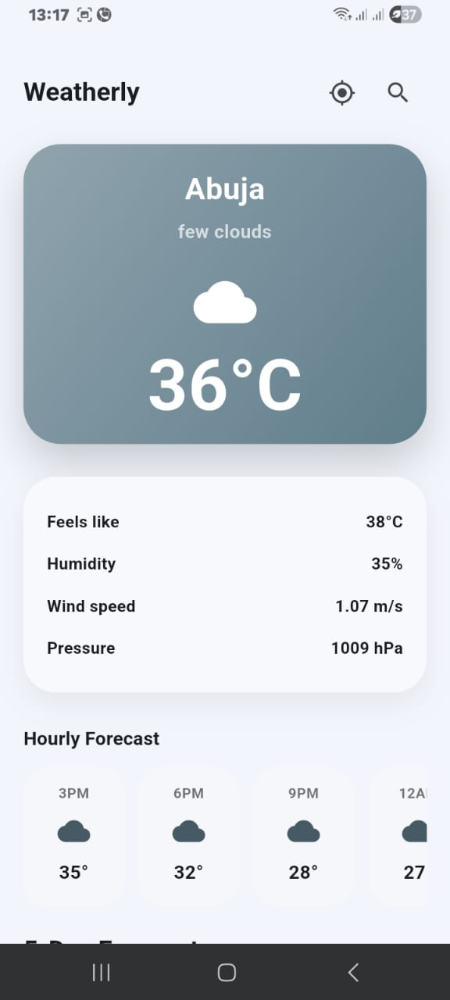
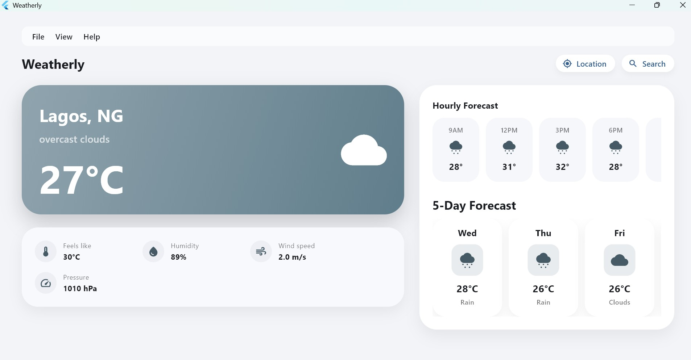
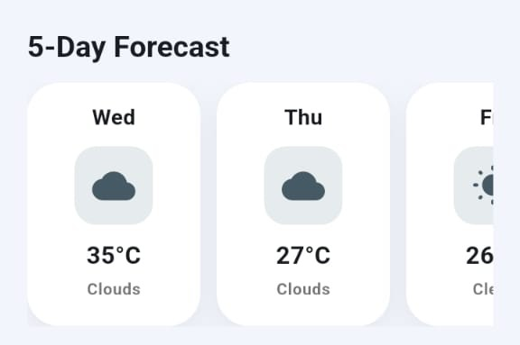

# Weatherly – Cross-Platform Weather App

## Overview

Weatherly is a cross-platform weather application built with Flutter, designed to run seamlessly across mobile, web, and desktop from a single codebase.

This project was developed as part of the HNG Internship (Stage 4 – Mobile Track), with a focus on platform adaptability, user interaction patterns, and maintaining a consistent experience across devices.

---

## Platforms Supported

- Android (Mobile)
- Web (Chrome, Edge, Firefox)
- Desktop (Windows)

The application dynamically adapts its layout and interaction model based on screen size rather than platform type, ensuring consistency across devices.

---

## Features

### Core Functionality

- Real-time weather data using OpenWeatherMap API
- City-based weather search
- Location-based weather detection
- Hourly forecast
- 5-day forecast
- Offline caching of last successful result using Hive

---

### Cross-Platform Adaptation

The application implements responsive UI design:

- Mobile: Single-column layout optimized for touch interaction
- Desktop/Web: Two-column layout with expanded content and better information hierarchy
- Layout switching is based on screen width, not platform

---

### Desktop Enhancements

To improve desktop usability, the following features were implemented:

- Resizable window support with adaptive content layout
- Desktop-style menu bar:
  - File → Search City, Load Default, Close Search
  - View → Refresh Weather, Use Location
  - Help → About dialog
- Right-click context menu for quick actions
- Mouse hover states for better interactivity
- Keyboard interaction support (Alt-based shortcuts for key actions)

---

### UI/UX Features

- Dynamic theming based on weather conditions
- Gradient backgrounds reflecting weather states
- Smooth animations:
  - Hero card entrance animation
  - Forecast transitions
  - Skeleton shimmer loading state
- Clean and modern interface designed for both mobile and desktop use

---

## Architecture

The application follows a modular and scalable architecture:

- State Management: Provider
- Data Flow:
  UI → Provider → Service Layer → API → Model → UI
- Local Storage: Hive (for lightweight offline caching)

---

### Project Structure

| Directory | Purpose |
|---|---|
| `lib/core/` | Shared constants, helpers, utilities, and reusable services |
| `lib/features/weather/data/` | Weather models, API services, and caching logic |
| `lib/features/weather/providers/` | Provider-based state management |
| `lib/features/weather/layouts/` | Adaptive layouts for mobile and wide screens |
| `lib/features/weather/screens/` | Main screen and platform coordination |
| `lib/features/weather/widgets/` | Reusable weather UI components |
| `assets/screenshots/` | Screenshots used in documentation |

---

## Animations

The application includes subtle animations to enhance user experience:

- Animated hero section (fade and slide transitions)
- Forecast list entrance animations
- Temperature value transition animation
- Skeleton loading shimmer effect

---

## Error Handling

The application handles real-world scenarios gracefully:

- Invalid city input
- Network connectivity failures
- Location permission handling
- Offline fallback using cached data

Sensitive information such as API keys is not exposed to users.

---

## API Integration

- OpenWeatherMap API  
https://openweathermap.org/api  

---

## Screenshots

### Mobile View


### Desktop View


### Forecast Section


### Error State


---

## Live Preview

- Appetize (Mobile Simulation):  
https://appetize.io/app/b_ghkel4rf35kmlx4se277xghl7m  

- Web Version:  
https://weatherly-cross-platform.netlify.app/

---

## Desktop Build

Download Windows executable (.zip):  
https://drive.google.com/file/d/112VJAvtRmik9sh9g2owxVB29Tib6XFN6/view?usp=sharing

---

## Demo Video

https://drive.google.com/file/d/1jE7Wx2uE6RctYH9uHZh40f7oX8HddMeb/view?usp=sharing

---

## Known Limitations

- Some keyboard shortcuts may be restricted on web due to browser-level conflicts
- Location services may behave differently across platforms
- API rate limits depend on OpenWeatherMap usage policy

---

## Challenges Encountered

- The web deployment initially failed because the app depended on a `.env` file that was not available as a static asset on Netlify. This was resolved by making dotenv optional and injecting the API key during build using `--dart-define`.
- Adapting the mobile layout for desktop and web required restructuring the UI into adaptive layouts based on screen width.
- Desktop input support required combining multiple patterns, including menu actions, right-click context menus, hover states, and keyboard shortcuts.

---

## How to Run

```bash
flutter pub get
flutter run
```

### Build for web

```bash
flutter build web
```

### Build for windows

```bash
flutter build windows
```

